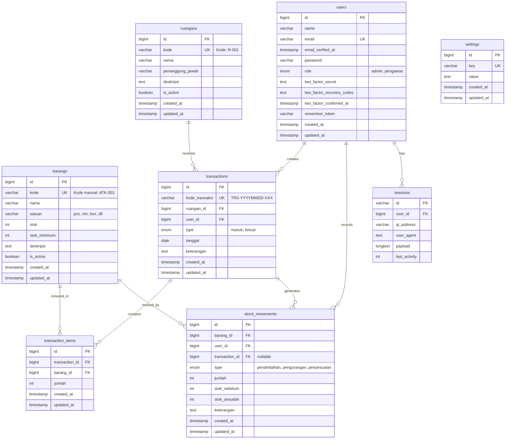

# ERD - Sistem ATK Mahkamah Agung (Mermaid)

## Cara Penggunaan:
1. Buka https://mermaid.live
2. Copy-paste kode di bawah ini
3. Diagram akan ter-generate otomatis

---

---

## Penjelasan Relasi:

| Tabel Asal | Relasi | Tabel Tujuan | Keterangan |
|------------|--------|--------------|------------|
| users | 1:N | transactions | 1 user mencatat banyak transaksi |
| users | 1:N | stock_movements | 1 user mencatat banyak pergerakan stok |
| users | 1:N | sessions | 1 user punya banyak session |
| ruangans | 1:N | transactions | 1 ruangan punya banyak transaksi |
| transactions | 1:N | transaction_items | 1 transaksi punya banyak item |
| transactions | 1:N | stock_movements | 1 transaksi generate banyak movement |
| barangs | 1:N | transaction_items | 1 barang ada di banyak item transaksi |
| barangs | 1:N | stock_movements | 1 barang punya banyak riwayat stok |
