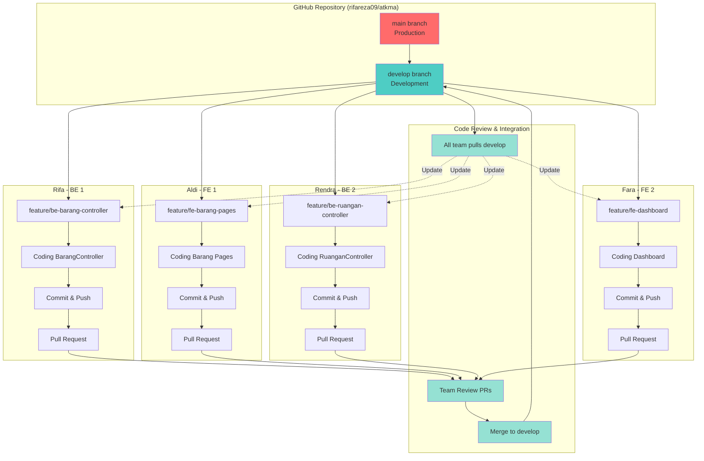
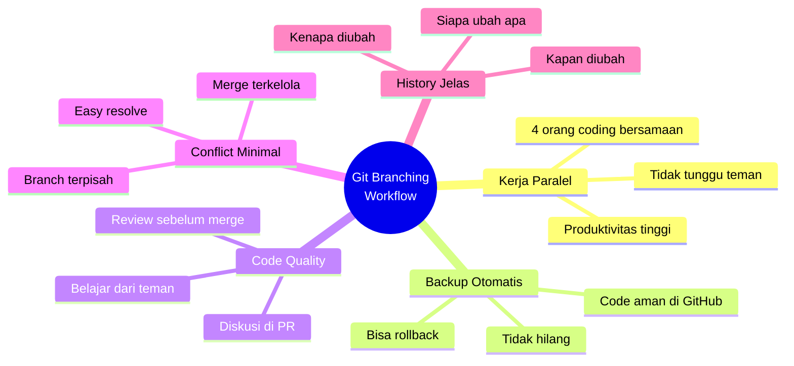
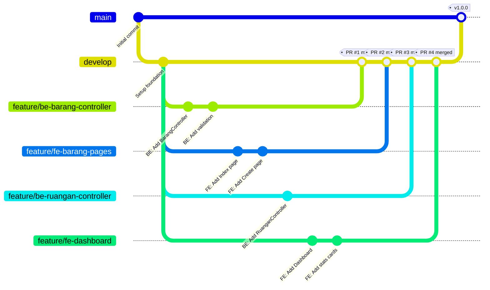
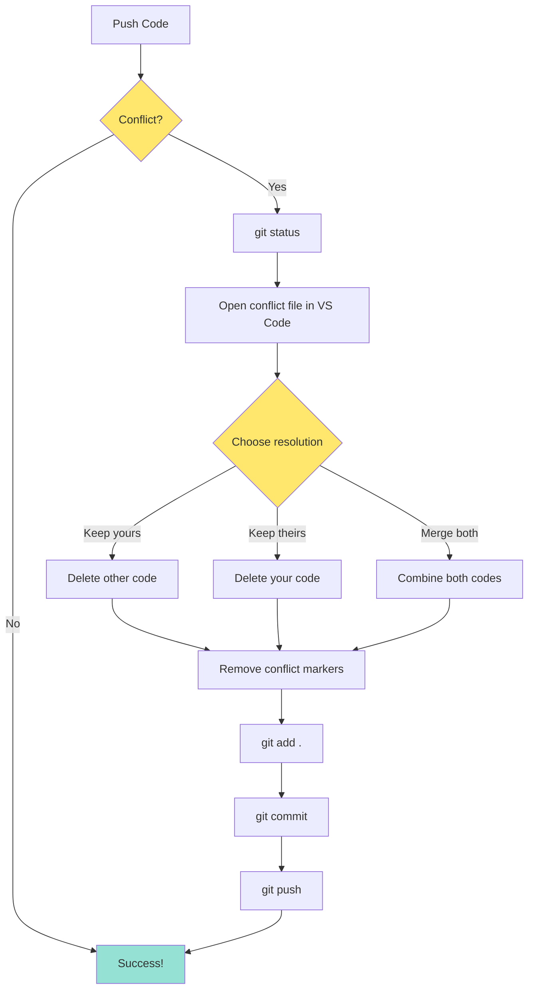

# Diagram Workflow Tim

## Workflow Paralel - 4 Developer Bekerja Bersamaan

## Timeline Kerja Harian

```mermaid
gantt
    title Workflow Harian Tim (Contoh)
    dateFormat HH:mm
    axisFormat %H:%M
    
    section Setup
    Pull develop latest    :09:00, 15m
    
    section Rifa (BE 1)
    Create branch BE        :09:15, 10m
    Coding BarangController :09:25, 3h
    Commit & Push          :12:25, 10m
    Coding lanjutan        :13:00, 3h
    Final commit & PR      :16:00, 15m
    
    section Aldi (FE 1)
    Create branch FE        :09:15, 10m
    Coding Barang Pages    :09:25, 3h
    Commit & Push          :12:25, 10m
    Coding lanjutan        :13:00, 3h
    Final commit & PR      :16:00, 15m
    
    section Rendra (BE 2)
    Create branch BE2       :09:15, 10m
    Coding RuanganController:09:25, 3h
    Commit & Push          :12:25, 10m
    Coding lanjutan        :13:00, 3h
    Final commit & PR      :16:00, 15m
    
    section Fara (FE 2)
    Create branch FE2       :09:15, 10m
    Coding Dashboard       :09:25, 3h
    Commit & Push          :12:25, 10m
    Coding lanjutan        :13:00, 3h
    Final commit & PR      :16:00, 15m
    
    section Review
    Team Code Review       :16:15, 45m
    Merge PRs              :17:00, 30m
    All sync develop       :17:30, 15m
```

## Keuntungan Workflow Ini

## Branch Strategy

## Conflict Resolution Flow

---

**Catatan**: 
- Diagram ini dibuat dengan Mermaid syntax
- Bisa dilihat langsung di GitHub atau VS Code dengan Mermaid extension
- Untuk export ke PNG/SVG, bisa pakai https://mermaid.live
